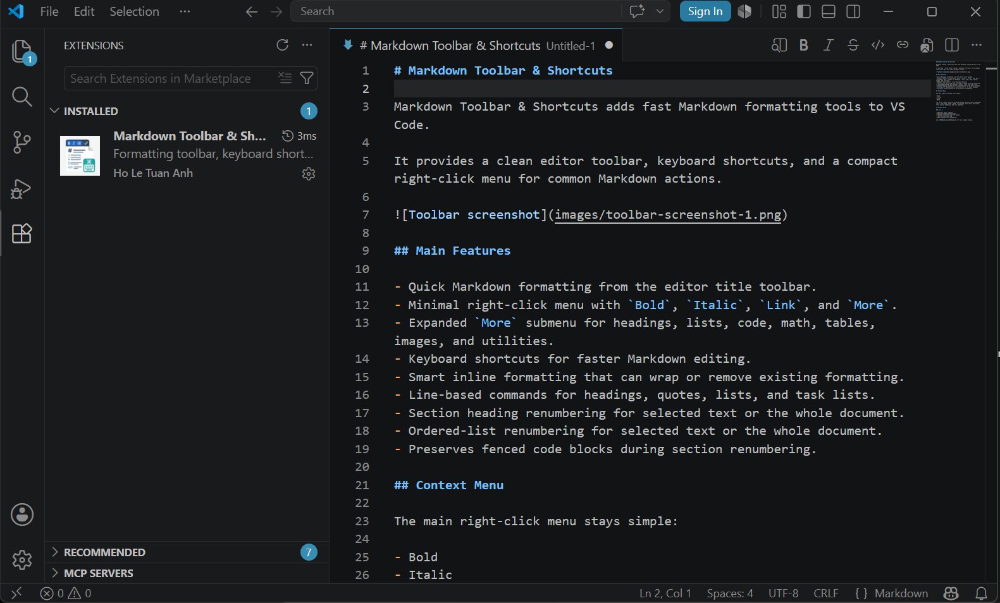
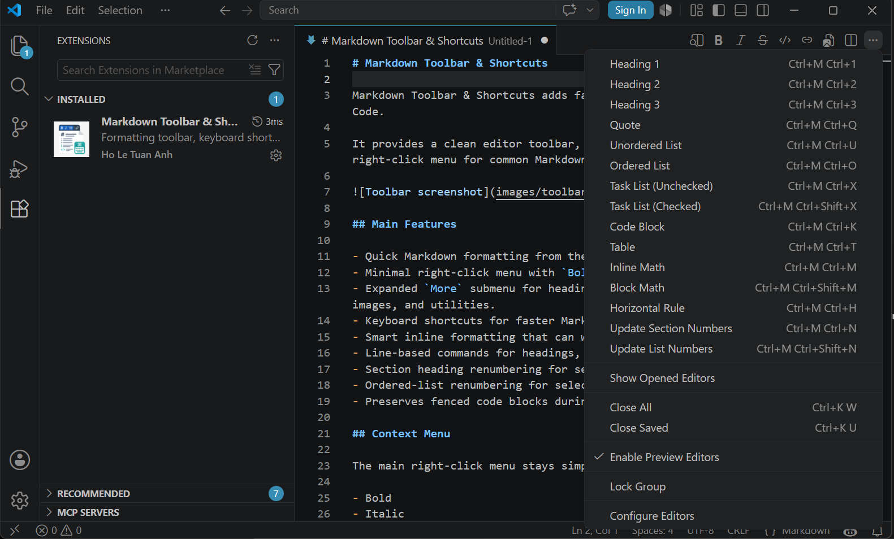
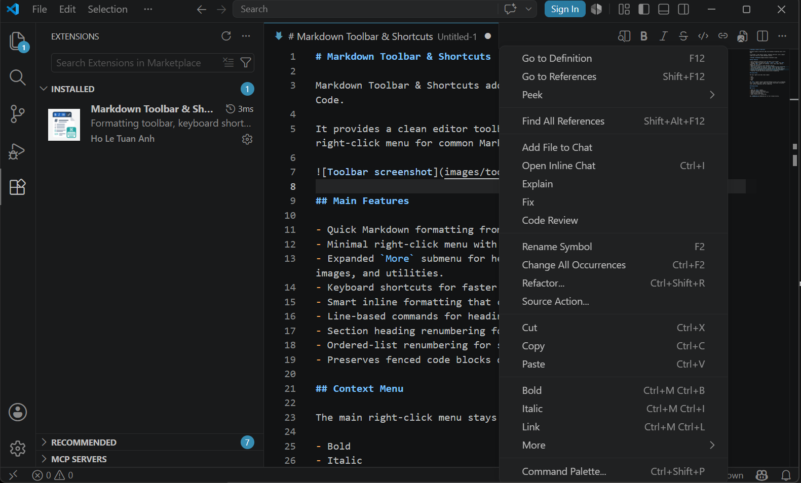

# Markdown Toolbar & Shortcuts

Markdown Toolbar & Shortcuts adds fast Markdown formatting actions to VS Code with a title-bar toolbar, keyboard shortcuts, and a cleaner right-click menu.

*Toolbar actions in a Markdown editor.*

*Additional toolbar and formatting workflow view.*

*Minimal main context menu with the expanded `More` submenu.*

## Features

- Editor title toolbar for common Markdown formatting actions.
- Minimal right-click context menu with `Bold`, `Italic`, `Link`, and `More`.
- Expanded `More` submenu for headings, lists, math, tables, code blocks, and utilities.
- Keyboard shortcut support for direct formatting and `Ctrl+M` command chords.
- Toggle-aware inline formatting, line-based transforms, and section number updates.
- Dedicated utilities to renumber section headings and ordered lists.

## Context Menu

The main right-click menu stays intentionally short:

- Bold
- Italic
- Link
- More

The `More` submenu includes:

- Open Codex Sidebar
- Strikethrough
- Inline Code
- Link
- Image
- Heading 1
- Heading 2
- Heading 3
- Quote
- Unordered List
- Ordered List
- Task List (Unchecked)
- Task List (Checked)
- Code Block
- Table
- Inline Math
- Block Math
- Horizontal Rule
- Update Section Numbers
- Update List Numbers

## Keyboard Shortcuts

All shortcuts are active only while editing Markdown files.

| Shortcut | Command |
| --- | --- |
| `Ctrl+B` | Bold |
| `Ctrl+I` | Italic |
| `Ctrl+K` | Link |
| `Ctrl+M Ctrl+B` | Bold |
| `Ctrl+M Ctrl+I` | Italic |
| `Ctrl+M Ctrl+C` | Inline Code |
| `Ctrl+M Ctrl+S` | Strikethrough |
| `Ctrl+M Ctrl+1` | Heading 1 |
| `Ctrl+M Ctrl+2` | Heading 2 |
| `Ctrl+M Ctrl+3` | Heading 3 |
| `Ctrl+M Ctrl+Q` | Quote |
| `Ctrl+M Ctrl+U` | Unordered List |
| `Ctrl+M Ctrl+O` | Ordered List |
| `Ctrl+M Ctrl+X` | Task List (Unchecked) |
| `Ctrl+M Ctrl+Shift+X` | Task List (Checked) |
| `Ctrl+M Ctrl+L` | Link |
| `Ctrl+M Ctrl+G` | Image |
| `Ctrl+M Ctrl+M` | Inline Math |
| `Ctrl+M Ctrl+Shift+M` | Block Math |
| `Ctrl+M Ctrl+K` | Code Block |
| `Ctrl+M Ctrl+T` | Table |
| `Ctrl+M Ctrl+H` | Horizontal Rule |
| `Ctrl+M Ctrl+N` | Update Section Numbers |
| `Ctrl+M Ctrl+Shift+N` | Update List Numbers |
| `Ctrl+M Ctrl+P` | Preview to Side |

## Behavior

- Inline commands wrap selected text and toggle off when the selection is already formatted.
- Line-based commands apply to each selected line.
- `Update Section Numbers` renumbers H1-H3 headings for the current selection, or for the whole file when nothing is selected.
- `Update List Numbers` renumbers ordered lists for the current selection, or for the whole file when nothing is selected.
- Fenced code blocks are preserved during section renumbering.

## Release Notes

### v1.0.0

- Initial release on the VS Code Marketplace.

See [CHANGELOG.md](CHANGELOG.md) for the full release history.

---

[GitHub Repository](https://github.com/skypediacode/markdown-toolbar) · [Report an Issue](https://github.com/skypediacode/markdown-toolbar/issues)
